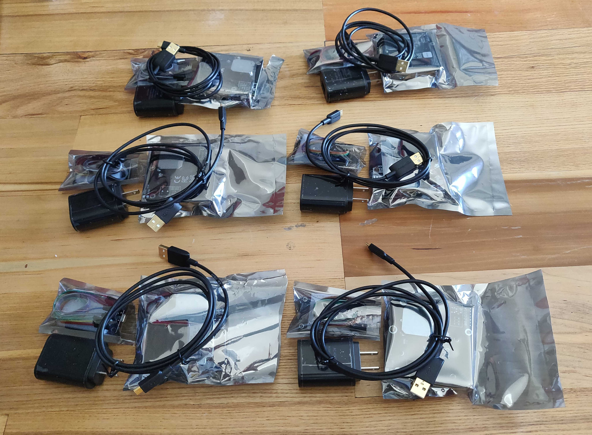
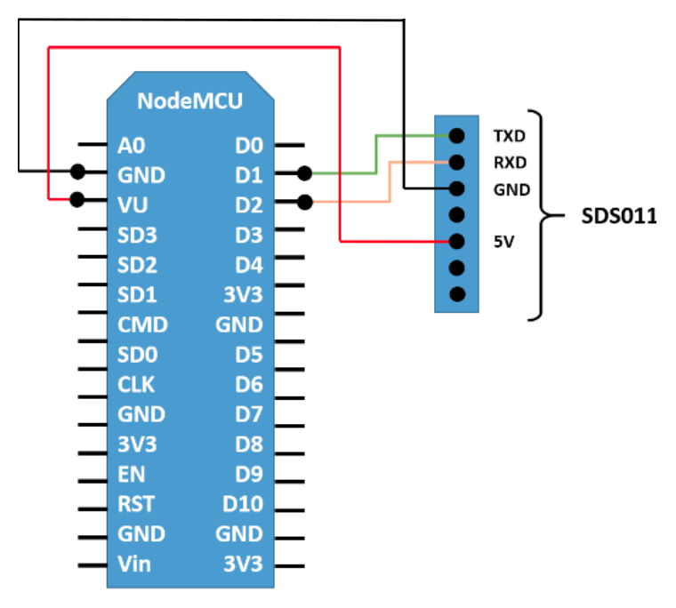
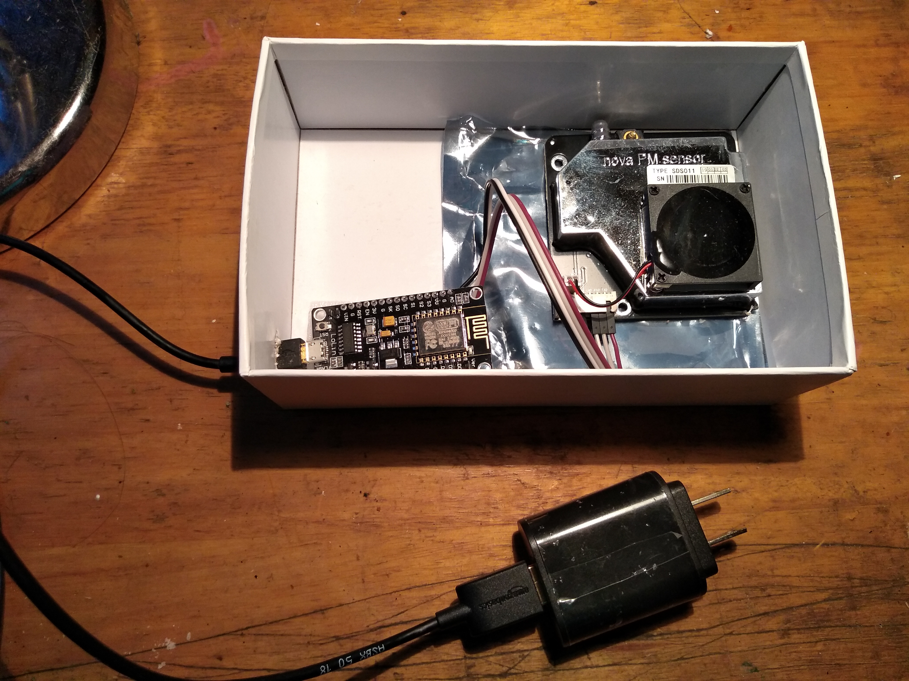

### Introducción

Mexicali, zona fronteriza y capital de Baja California es una ciudad muy importante para México y un lugar que muchos de nosotros consideramos nuestro hogar. Como ciudadanos, nos enfrentamos a diversos tipos de problemas. Algunos temas son exclusivos de Mexicali. Sin embargo, la mayoría se comparten y/o son similares a los problemas que experimentan otras personas que viven en áreas urbanas.

Un problema científicamente documentado es la contaminación del aire (polución). Las partículas en suspención, son una serie de diminutos cuerpos sólidos o de gotitas de líquidos dispersos en la atmósfera. Son generadas a partir de alguna actividad antropogénica (causada por «el hombre», como la quema de carbón para producir electricidad) o natural (como por ejemplo la actividad volcánica)[[1]](https://es.wikipedia.org/wiki/Part%C3%ADculas_en_suspensi%C3%B3n). Las partículas se categorizan según su tamaño, pueden tener cualquier forma y pueden ser sólidas o gotas líquidas. 

Específicamente en Mexicali se presentan altos niveles de _PM<sub>2.5</sub>_ y _PM<sub>10</sub>_. La acumulación de altos niveles de estas partículas provocan problemas de salud tales como: muerte prematura debido a enfermedades cardiovasculares y pulmonares, ataques cardíacos, asma agravada, disminución de la función pulmonar, tos y dificultad para respirar. En [WHO: Breathe Life - How air pollution impacts your body](https://www.youtube.com/watch?v=GVBeY1jSG9Y&t=12s) y [What does Air Pollution PM 2.5 do inside children's body and brain? ](https://www.youtube.com/watch?v=QcS3ovdsgNI) se describen brevemente las consecuencias de la contaminación en el aire. 

Algunos de los estudios de casos relacionados con Mexicali, pueden consultarse en los siguientes enlaces:

1. [Correlation Study of the Association of PM10 with the Main Respiratory Diseases in the Populations of Mexicali, Baja California and Imperial County, California](http://rmib.com.mx/index.php/rmib/article/download/246/308).
2. [Air Quality in Mexicali, Baja California](https://journals.lww.com/epidem/fulltext/2008/11001/Air_Quality_in_Mexicali,_Baja_California.22.aspx#pdf-link).
3. [The Program to Improve the Air Quality of Mexicali, Baja California, Mexico 2010-2015](https://www.sciencedirect.com/science/article/pii/S1878029610001246).
4. [An estimation of costs and public-health benefits by the PM<sub>10</sub> mitigation in Mexicali, Baja California Mexico](http://www.scielo.org.mx/pdf/rica/v33n1/0188-4999-rica-33-01-00117.pdf).
5. [Association between personal PM<sub>10</sub> exposure and pulmonary function in healthy volunteers from a semi-arid city on the us-mexican border](https://www.revistascca.unam.mx/rica/index.php/rica/article/download/RICA.2018.34.04.03/46793).

### Proyecto OpenSource Calidad del Aire Mexicali

Mexicali Open Source ha obtenido los materiales para producir algunos sensores. Estos sensores han sido ensamblados, programados, y conectados a la API de  [Luftdaten](https://luftdaten.info/). Los sensores activos de Luftdaten en Mexicali pueden ser monitoreados a través del siguiente [Mapa](https://deutschland.maps.luftdaten.info/#12/32.6305/-115.4144).



> ¡Los datos están abiertos! ¡Están disponibles para todos!

### ¿Qué sucederá después? Depende. ¿Qué te gustaría hacer?

Algunas de las actividades en las que podemos participar como comunidad son:

1. Construir sensores de calidad del aire.
2. Compartir conocimientos técnicos con la comunidad.
3. Establecer una red con grupos de la comunidad para fomentar la conciencia y la participación de los ciudadanos para mejorar las cosas.
4. Desarrollar y proporcionar métodos para la discusión comunitaria, el conocimiento y las noticias.

### Guía de construcción del sensor Luftdaten

A continuación se presenta una guía para el ensamblaje del dispositivo para la adqusición de datos de la calidad del aire.

#### Materiales

Para la construcción del dispositivo necesitamos los siguientes materiales:

1. Microcontrolador [NodeMCU ESP8266](https://www.nodemcu.com/index_en.html)
2. Sensor para la calidad del aire [SDS011](https://aqicn.org/sensor/sds011)
   
#### Configuración

1. Para comunicarse con el ESP8266, necesita controladores usb2serial. 
   1. Linux: no requiere instalación, el chip debe ser compatible (verificar con dmesg)
   2. MacOS: para Sierra vea estas instrucciones probadas con éxito: https://github.com/adrianmihalko/ch340g-ch34g-ch34x-mac-os-x-driver
   3. Windows: pruebe con el controlador del fabricante.
   4. Raspberry Pi: https://github.com/aperepel/raspberrypi-ch340-driver
2. Importar Firmware [[2]](https://luftdaten.info/en/construction-manual/) (tip: solo copia las instrucciones)
   1. Pasos independientes al Sistema Operativo
         1. Descarga e instala el software de Arduino en tu computadora: https://www.arduino.cc/en/Main/Software
         2. Busca en la configuración el menú “Additional Board Manager URLs” e inserta esta URL: http://arduino.esp8266.com/stable/package_esp8266com_index.json
         3. En el siguiente menú "Tools -> Board ... -> Board Administrator" busca "esp8266" e instala "esp8266 by ESP8266 Community"
         4. Ya puedes cerrar el IDE de Arduino.
         5. Descarga el firmware en idioma Inglés: https://www.madavi.de/sensor/update/data/latest_en.bin
         6. Conecte el NodeMCU con su computadora. De ser posible conecte un cable USB 2.0 a un puerto USB 2.0 de lo contrario no podrá ser reconocido en Windows.
         7. Windows
            * Abre la línea de comandos (cmd.exe).
            * Ejecuta lo siguiente
            ```sh
            “%USERPROFILE%\AppData\Local\Arduino15\packages\esp8266\tools\esptool\0.4.9\esptool.exe” -vv -cd nodemcu -cb 57600 -ca 0x00000 -cp COM11 -cf “_ruta_al_archivo_firmware_descargado” (el puerto detrás de ‘-cp’ podría necesitar ser ajustado)
            ```
         8. MAC/Linux
            * Abre una Terminal.
            * Linux: 
            ```sh
            ~/.arduino15/packages/esp8266/tools/esptool/0.4.9/esptool -vv -cd nodemcu -cb 57600 -ca 0x00000 -cp /dev/cu.wchusbserial1410 -cf /ruta/al/archivo/firmware (el puerto detrás de ‘-cp’ podría necesitar ser ajustado)
            ```
            * MacOS:
            ```sh
            ~/Library/Arduino15/packages/esp8266/tools/esptool/0.4.9/esptool -vv -cd nodemcu -cb 57600 -ca 0x00000 -cp /dev/cu.wchusbserial1410 -cf /ruta/al/archivo/firmware (el puerto detrás de ‘-cp’ podría necesitar ser ajustado)
            ```

        _**NOTA**_: El puerto apropiado se puede encontrar, por ejemplo, conectando el nodo al puerto deseado (vea la nota anterior) y luego iniciando el IDE de Arduino.           

#### Ensamblaje

Para el ensamblaje tomamos como referencia el siguiente diagrama.



Podemos construir o improvisar una cubierta al dispositivo para evitar su exposición.



#### Conectividad

Para lograr la conectividad del dispositivo a través de Internet, lo primero que debemos hacer es buscar entre nuestras opciones de redes inalámbricas una conexión con el siguiente formato **_Feinstaubsensor-Device-ID_**, como se muestra en la imágen.


Posteriormente, debemos acceder desde el navegador a la siguiente dirección `http://192.168.4.1`. En esta ruta, se muestra un panel para la configuración de nuestro dispositivo con la red inalámbrica local, como se muestra a continuación.

Nuestra red de área local es un puente de comunicación entre el dispositivo de adquisición de datos con Internet.

### Referencias

1. [Particulas en suspensión](https://es.wikipedia.org/wiki/Part%C3%ADculas_en_suspensi%C3%B3n)
2. [Fine dust sensor – construction manual](https://luftdaten.info/en/construction-manual/)