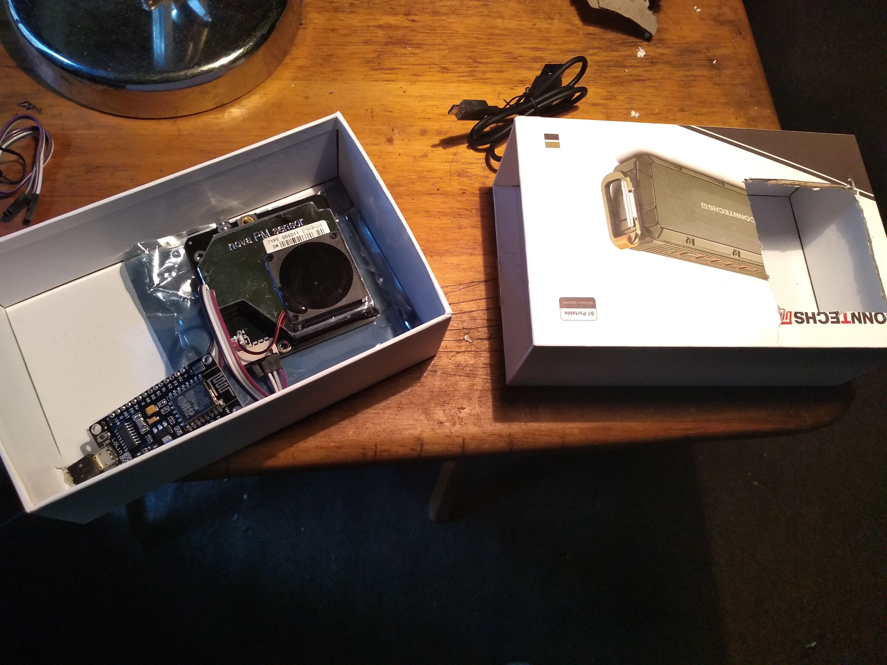
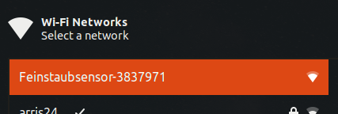
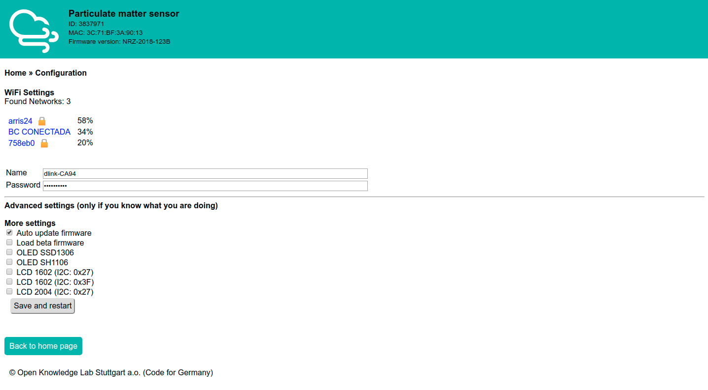

### Introducción

Mexicali, zona fronteriza y capital de Baja California es una ciudad muy importante para México y un lugar que muchos de nosotros consideramos nuestro hogar. Como ciudadanos, nos enfrentamos a diversos tipos de problemas. Algunos temas son exclusivos de Mexicali. Sin embargo, la mayoría se comparten y/o son similares a los problemas que experimentan otras personas que viven en áreas urbanas.

Un problema científicamente documentado  es la contaminación del aire. Específicamente, Mexicali tiene altos niveles de [partículas muy pequeñas o PPM](https://bit.ly/2MKaqBa): _PPM2.5_(la más pequeña y mortal de las dos) y _PPM10_.

La acumulación de altos niveles de estas partículas provocan problemas de salud tales como: muerte prematura debido a enfermedades cardiovasculares y pulmonares, ataques cardíacos, asma agravada, disminución de la función pulmonar, tos y dificultad para respirar. En este [video](https://www.youtube.com/watch?v=GVBeY1jSG9Y&t=12s) desarrollado por la Organización Mundial de la Salud se muestra una breve explicación acerca de este problema.

### ¿Qué ha pasado desde entonces?

Mexicali Open Source ha obtenido los materiales para producir algunos sensores. Estos sensores han sido ensamblados, programados, y conectados a la API de  [Luftdaten](https://luftdaten.info/). A partir de Mayo de 2019, los sensores activos de Luftdaten en Mexicali están visibles y pueden ser monitoreados a través del [Mapa Global](https://deutschland.maps.luftdaten.info/#12/32.6305/-115.4144).

> ¡Los datos están abiertos! ¡Están disponibles para todos!

### ¿Qué sucederá después? Depende. ¿Qué te gustaría hacer?

Algunas de las actividades en las que podemos participar como comunidad son:

1. Construir sensores de calidad del aire.
2. Compartir conocimientos técnicos con la comunidad.
3. Establecer una red con grupos de la comunidad para fomentar la conciencia y la participación de los ciudadanos para mejorar las cosas.
4. Desarrollar y proporcionar métodos para la discusión comunitaria, el conocimiento y las noticias.

### Guía de construcción del sensor Luftdaten

#### Materiales

Para la construcción del dispositivo necesitamos los siguientes materiales:

1. Microcontrolador [NodeMCU ESP8266](https://www.nodemcu.com/index_en.html)
2. Sensor para la calidad del aire [SDS011](https://aqicn.org/sensor/sds011)
   
#### Ensamblaje

Para el ensamblaje tomamos como referencia el siguiente diagrama.

Podemos construir o improvisar una cubierta al dispositivo para evitar su exposición.

#### Conectividad

Para lograr la conectividad del dispositivo a través de Internet, lo primero que debemos hacer es buscar entre nuestras opciones de redes inalámbricas una conexión con el siguiente formato **_Feinstaubsensor-Device-ID_**, como se muestra en la imágen.

Posteriormente, debemos acceder desde el navegador a la siguiente dirección `http://192.168.4.1`. En esta ruta, se muestra un panel para la configuración de nuestro dispositivo con la red inalámbrica local, como se muestra a continuación.

Nuestra red de área local es un puente de comunicación entre el dispositivo de adquisición de datos con Internet.

### Referencias

1. [Correlation Study of the Association of PM10 with the Main Respiratory Diseases in the Populations of Mexicali, Baja California and Imperial County, California](http://rmib.com.mx/index.php/rmib/article/download/246/308).
2. [Air Quality in Mexicali, Baja California](https://journals.lww.com/epidem/fulltext/2008/11001/Air_Quality_in_Mexicali,_Baja_California.22.aspx#pdf-link).
3. [The Program to Improve the Air Quality of Mexicali, Baja California, Mexico 2010-2015](https://www.sciencedirect.com/science/article/pii/S1878029610001246).
4. [An estimation of costs and public-health benefits by the PM10 mitigation in Mexicali, Baja California Mexico](http://www.scielo.org.mx/pdf/rica/v33n1/0188-4999-rica-33-01-00117.pdf).
5. [Association between personal PM10 exposure and pulmonary function in healthy volunteers from a semi-arid city on the us-mexican border](https://www.revistascca.unam.mx/rica/index.php/rica/article/download/RICA.2018.34.04.03/46793).