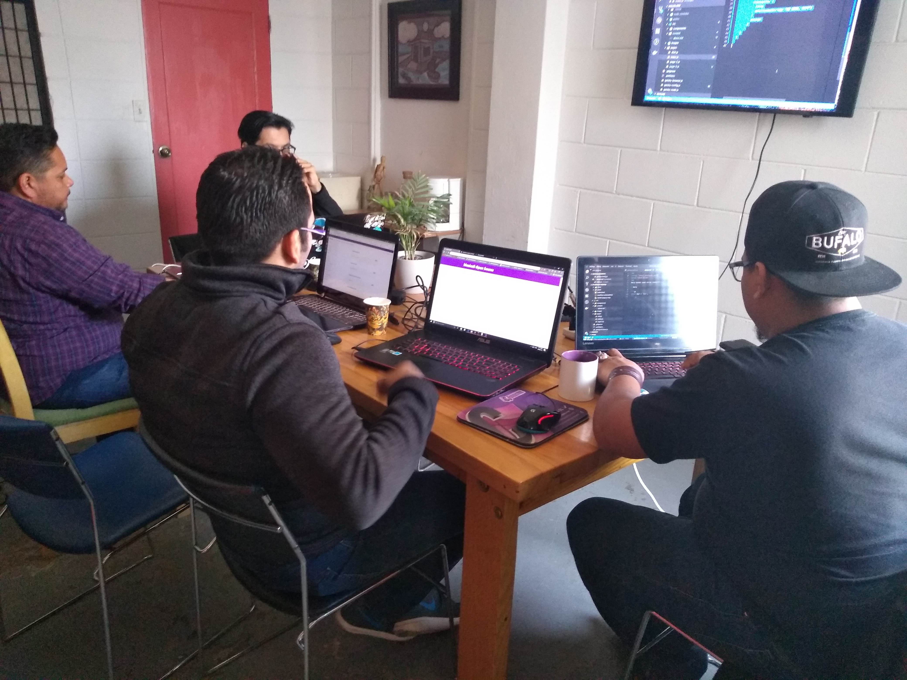

### Introducción

Durante los últimos fines de semana algunos miembros de la comunidad de Mexicali Open Source nos reunimos en las instalaciones de [La Playa Delux Coworking](https://www.facebook.com/LaPlayaDeLux/) con el objetivo de conocer e implementar los conceptos básicos de la herramienta de desarrollo ágil para sitios estáticos [Gatsby](https://www.gatsbyjs.org/).



Gatsby es una herramienta muy potente basada en [ReactJS](https://reactjs.org/) (librería desarrollada e implementada por Facebook para construir interfaces gráficas). Si estas comenzando o quieres aprender ReactJS, inclusive puedes utilizar Gatsby como medio para este propósito. 

Por otra parte, Gatsby cuenta con una gama de diversos tipos de _plugins_ (librerías que proveen funcionalidad particular) para extender su funcionalidad. Una de las principales fortalezas de Gatsby esta en su flexibilidad para el manejo de diferentes fuentes de datos, es decir, las fuentes de datos pueden proveenir de diferentes tipos de archivos tales como: CSV, JSON, YAML, Documento de Google entre otros.

En esta serie de publicaciones describiremos el proceso de desarrollo de sitios estáticos con Gatsby. Para fines del tutorial, cabe mencionar que el entorno de desarrollo utilizado fue el siguiente:

1. Sistema Operativo de Linux Ubuntu versión _18.04_.
2. NodeJS versión _10.15.3_.

### Instalación de NodeJS

Para comenzar con Gatsby, es importante contar con una versión reciente o posterior a la _**8.x**_ de [NodeJS](https://nodejs.org) en nuestro Sistema Operativo. 

Para la instalación de NodeJS [[1]](https://linux4one.com/how-to-install-node-js-with-npm-on-ubuntu-18-04/) necesitamos agregar a la lista lista de repositorios, un enlace a la fuente que contenga una versión reciente del mismo.

```bash
$ curl -sL https://deb.nodesource.com/setup_10.x | sudo bash -
```

Después, actualizamos los repositorios locales con el siguiente comando.

```bash
$ sudo apt update ; sudo apt upgrade
```

Procedemos entonces con la instalación de NodeJS y el gestor de paquetes NPM.

```bash
$ sudo apt install nodejs npm
```

Para validar dicha instalación, ejecutamos los siguientes comandos respectivamente.

```bash
$ node -v
$ npm -v
```

### Instalación de Gatsby

Antes de comenzar con la instalación, cabe destacar que es altamente recomendado utilizar el gestor de paquetes NPM como usuario regular, es decir, sin especificar el famoso comando _**sudo**_ el cuál nos otorgá privilegios de _super usuario_. Para este último propósito, podemos seguir los pasos recomendados en [[2]](https://docs.npmjs.com/resolving-eacces-permissions-errors-when-installing-packages-globally) y a continuación descritos.

1. El primer paso, consiste en crear un directorio oculto en el directorio HOME de nuestro sistema.

```bash
$  mkdir ~/.npm-global
```

2. Después debemos exportar la variable de entorno que apunte al directorio creado anteriormente.

```bash
$ export PATH=~/.npm-global/bin:$PATH
```

3. Enseguida debemos actualizar las variables del sistema con el siguiente comando.

```bash
$ source ~/.profile
```

4. Por último, para la instalación del intérprete de comandos de Gatsby ejecutamos la siguiente instrucción.

```bash
$ npm install -g gatsby-cli
```

El prefijo `-g` permite contar con el intérprete de comandos de Gatsby de forma global, es decir, lo podemos ejecutar desde cualquier ubicación del sistema a través de nuestra Terminal.

### Crear un sitio con Gatsby

Para crear un nuevo sitio [[3]](https://www.gatsbyjs.org/docs/quick-start), ejecuta el siguiente comando.

```bash
$ gatsby new blog
```

Cámbiate al directorio de tú sitio, es decir, `blog`.

```bash
$ cd blog
```

Ejecuta el servicio de Gatsby en modo de desarrollo ejecutando la siguiente instrucción.

```bash
$ gatsby develop
```

Posteriormente, accede a la siguiente dirección `http://localhost:8000/` desde tú navegador web para observar el siguiente resultado.


Si todo ha ido bien, a partir de este momento ya podemos desarrollar páginas para nuestro sitio.

### ¿Como crear una nueva página?

Para crear una nueva página, agregaremos un archivo llamado `new-page.js` dentro de la carpeta `blog/src/pages` con el siguiente contenido:

```jsx{numberLines: true}
import React from 'react'

const NewPage = () => (
  <h1>Hola desde una nueva página</h1>
)

export default NewPage
```

Al acceder a la siguiente ruta `http://localhost:8000/new-page` el resultado debe ser similar al siguiente.


Como puedes observar, no fue necesario establecer mecanismos para el enrutamiento o direccionamiento hacia nuestra nueva página. Esto es  parte del potencial que ofrece Gatsby para el desarrollo ágil.

Por otro lado, sin notarlo ya hemos interactuado con componentes de ReactJS, ya que precisamente esto es lo que hemos desarrollado _**¡un componente!**_, que posteriormente fue procesado y traducido a una página HTML por parte de Gatsby.

Sin embargo, no se parece mucho a la página ubicada en la raíz del sitio, ¿cierto?, esto es debido a que su contenido no incluye la plantilla de diseño predeterminada. 

Para realizar este ajuste, solo debemos importar la plantilla predeterminada a nuestro archivo `new-page.js`, como se muestra a continuación.

```jsx{numberLines: true}
import React from 'react'

import Layout from "../components/layout" // highlight-line

const NewPage = () => (
  // highlight-next-line
  <Layout>
    <h1>Hola desde una nueva página</h1>
  // highlight-next-line
  </Layout>
)

export default NewPage
```

Gracias a que Gatsby cuenta con _**hot-reloading**_ (mecanismo que construye el sitio en segundo plano evitando tener que refrescar el navegador) solo necesitamos regresar al navegador y observar la actualización realizada, como se muestra a continuación.


### Conclusiones

En esta primer entrega, hemos destacado algunos aspectos básicos de la herramienta de desarrollo ágil para sitios estáticos Gatsby. Además fue descrito el proceso de instalación del intérprete de comandos y para finalizar se mostro la facilidad con la que se pueden construir nuevas páginas a través de un ejemplo.

### Referencias
   1. [How to install Node.js with npm on Ubuntu 18.04](https://linux4one.com/how-to-install-node-js-with-npm-on-ubuntu-18-04/)
   2. [Resolving EACCES permissions errors when installing packages globally](https://docs.npmjs.com/resolving-eacces-permissions-errors-when-installing-packages-globally)
   3. [Gatsby Quick Start](https://www.gatsbyjs.org/docs/quick-start)